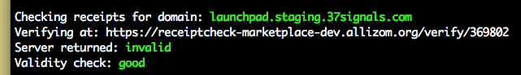

Firefox receipt parser
======================

This requires Firefox 14 and Python 2.7 or greater to be installed.

Creates a python script called receipts that will find Web App receipts in
your Firefox install and then allows you to check them against the verification
service contained within the receipt.

Tested on OS X, not sure about support for other operating systems yet.

Usage
~~~~~

To list receipts::

  receipts -l

To check a receipt for a specific domain. This will check the receipt against
the server and check that it is cryptographically correct. These are two
different steps::

  receipts -c DOMAINNAME

To check all domains::

  receipts -c

To expand a receipt for a specific domain::

  receipts -e DOMAINNAME

To expand all domains::

  receipts -e

By default receipts will try and find your default Firefox profile. If not it
will use one provided with -p, eg::

  receipts -l -p fx6

Example:

Phone
~~~~~

If you've got a B2G phone you can check the receipts on your phone. This
assumes that receipts are installed at::

  /data/local/webapps/webapps.json

Connect your phone to the USB cable and ensure that you've got access to adb.

Then add in the argument::

  --adb

To any of the above commands and instead of looking at Firefox, it will pull
the receipts file off your phone and examine that instead. For example::

  receipts --adb --list
